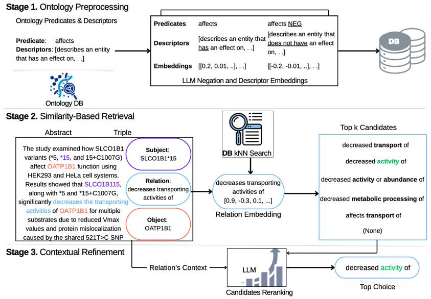
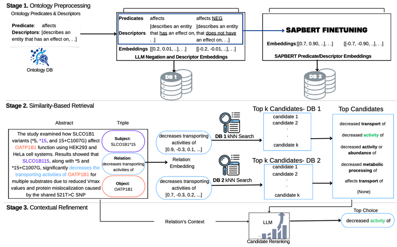

# RELATE Predicate Mapping Pipeline (Multi-Ontology Variant)

RELATE is a three-stage pipeline for mapping free-text biomedical `relationships` in any quadruple (subject, object, `relationship`, abstract) to standardized ontology `predicate` using a combination of embedding similarity and language model reasoning.



or for the SapBERT-enhanced workflow:



## Pipeline Overview

Stage 1. **Preprocessing Stage** (run infrequently):
   - Collects ontology predicate texts and their descriptors
     - Generates natural language negations for the predicate texts and their descriptors
     - Computes embeddings for the predicate descriptors 
     - Optional: Train SapBERT model and generate model weights for downstream prediction

Stage 2. **Similarity-based Retrieval**:
   - Accepts quadruple (subject, object, `relationship`, context) inputs
   - Loads precomputed embeddings for predicate text descriptors generated in Stage 1
   - Uses vector similarity (optional SapBERT predictions)
   - Returns top-matching predicates 

Stage 3. **Contextual Refinement**:
   - Reranks top-matching predicates with LLM reranking


### Local LLM Setup

For local inference with Ollama:

1. Install Ollama:
   ```bash
   curl -fsSL https://ollama.ai/install.sh | sh
   ```

2. Pull models:
   ```bash
   ollama pull alibayram/medgemma:27b
   ollama pull nomic-embed-text:latest
   ```
   
### The code in this repo supports multiple ontologies including Biolink and ChemProt

- **Biolink Model**: High-level datamodel of biological entities and associations
  - Source: [biolink-model](https://github.com/biolink/biolink-model)
  - Schema: [biolink-model.yaml](https://github.com/biolink/biolink-model/blob/master/biolink-model.yaml)

- **ChemProt**: Chemical-protein interaction corpus for relation extraction
  - Source: [BioCreative VI](https://huggingface.co/datasets/bigbio/chemprot)
  - Paper: [PMC5721660](https://www.ncbi.nlm.nih.gov/pmc/articles/PMC5721660/)

---
## Pipeline Setup and Installation

1. Create a new `directory`
2. Open the `directory` from terminal and create a Python virtual environment and activate it
```bash
    python3.12 -m venv venv
```
```bash
     source venv/bin/activate
```
3. Download the latest source code from 
```bash
https://github.com/RENCI-NER/pred-mapping/releases/tag/v1.0
```
4. Navigate to `pred-mapping` directory
```bash
 cd pred-mapping
```

5. Create `.env` and set the environment variables:

```bash
LLM_API_URL=http://localhost:11434/api/generate
CHAT_MODEL=alibayram/medgemma:27B
MODEL_TEMPERATURE=0.5
EMBEDDING_URL=http://localhost:11434/api/embeddings
EMBEDDING_MODEL=nomic-embed-text
ONTOLOGY=biolink   # or chemprot (small letters)
```

6. Install dependencies:
   ```bash
   pip install -r requirements.txt
   ```

### Stage 1: 
The eventual output of this stage for (Biolink and Chemprot) is already included in the downloaded [release](https://github.com/RENCI-NER/pred-mapping/releases/tag/v1.0). 

However, if you'd prefer to run the Preprocessing stage from scratch, the Implementation details can be found [Here](src/Preprocessing/README.md). Once this stage is completed, the directory structure should look like: 

```
   pred-mapping/
   ├── biolink_data/
   │   ├── biolink_short_description.json
   │   ├── all_biolink_mapped_vectors.json
   │   └── qualified_predicate_mappings.json
   ├── chemprot_data/
   │   ├── chemprot_short_description.json
   │   ├── all_chemprot_mapped_vectors.json
   │   └── qualified_predicate_mappings.json
   ├── Biolink_SapBert/                    # Optional SapBERT models
   │   ├── data/
   │   │   └── embedding_mappings.npy
   │   └── model/
   │── Chemprot_SapBert/                  # Optional SapBERT models
   │  ├── data/
   │  │   └── embedding_mappings.npy
   │  └── model/
   └── src/
       ├── Preprocessing/                    
       ├── llm_client.py
       ├── ontology_config.py
       ├── predicate_database.py
       ├── predicate_lookup.py 
       ├── server.py    
       └── utils.py
```
### Stage 2 and Stage 3:
The stages are bundled in a fast-API server. Start the server by running:
```bash
      sh main.sh 
```

---

### API (Swagger UI) Usage

Access the interactive API documentation from a browser at:
```
http://localhost:8000/docs
```

- API Endpoints

  - List available ontologies:
   ```
   GET /ontologies
   ```

  - Send a query (quadruple - subject, object, `relationship`, abstract)  
   ```
   POST /query
   ```

- API Parameters:
  - `ontology`: Ontology to use (biolink/chemprot)
  - `similarity_based_retrieval_method`: Search method (sklearn_knn/scipy_cosine)
  - `use_sapbert`: Enable SapBERT predictions (True/False)

**Sample Input quadruple:**
```json
[
  {
    "subject": "SLCO1B1*15",
    "object": "OATP1B1", 
    "relationship": "decreases transporting activities of",
    "abstract": "The study examined how SLCO1B1 variants (*5, *15, and 15+C1007G) affect OATP1B1 function using HEK293 and HeLa cell systems. Results showed that SLCO1B115,  along with *5 and *15+C1007G, significantly decreases the transporting activities of OATP1B1 for multiple substrates due to reduced Vmax values and protein mislocalization caused by the shared 521T>C SN"
  }
]
```

**Sample Response:**
```json
{
  "results": [
    {
      "subject": "SLCO1B1*15",
      "object": "OATP1B1", 
      "relationship": "decreases transporting activities of",
      "top_choice": {
        "predicate": "affects",
        "object_aspect_qualifier": "activity",
        "object_direction_qualifier": "decreased",
        "negated": false,
        "selector": "alibayram/medgemma:27B"
      },
      "Top_n_candidates": {
        "0": {
          "mapped_predicate": "decreased transport of",
          "score": 0.84652
        },
        "1": {
          "mapped_predicate": "decreased activity of",
          "score": 0.82094
        }, 
         "2": {
          "mapped_predicate": "decreased activity or abundance of",
          "score": 0.84652
        },
        "3": {
          "mapped_predicate": "decreased metabolic processing of",
          "score": 0.82094
        },
        "4": {
          "mapped_predicate": "affects transport of",
          "score": 0.82094
        }
      },
      "Top_n_retrieval_method": "sklearn_knn"
    }
  ],
  "ontology": "biolink"
}
```

The `Top_n_candidates` represent the output of Stage 2 (Similarity-based search) while `top_choice` depicts Stage 3 (LLM Reranking) outcome

If this Stage 3 fails (eg due to access to LLM), the system defaults to the top scoring candidate in the `Top_n_candidates`

### CURL Post Usage 

From the terminal, run:
```bash
curl -X POST "http://localhost:8000/query/" \
  -H "Content-Type: application/json" \
  -d '[{"subject": "SLCO1B1*15", "object": "OATP1B1", "relationship": "decreases transporting activities of", "abstract": "..."}]'
```

   - To specify an ontology:
   ```bash
   curl -X POST "http://localhost:8000/query/?ontology=chemprot" \
     -H "Content-Type: application/json" \
     -d '[{"subject": "SLCO1B1*15", "object": "OATP1B1", "relationship": "decreases transporting activities of", "abstract": "..."}]'
   ```
   
   - To Enable SapBERT:
   ```bash
   curl -X POST "http://localhost:8000/query/?use_sapbert=true" \
     -H "Content-Type: application/json" \
     -d '[{"subject": "SLCO1B1*15", "object": "OATP1B1", "relationship": "decreases transporting activities of", "abstract": "..."}]'
   ```
   
   **Use different similarity method:**
   ```bash
   curl -X POST "http://localhost:8000/query/?similarity_based_retrieval_method=scipy_cosine" \
     -H "Content-Type: application/json" \
     -d '[{"subject": "SLCO1B1*15", "object": "OATP1B1", "relationship": "decreases transporting activities of", "abstract": "..."}]'
   ```

---

### `src/` Component descriptions

1. `llm_client.py`: Handles local/remote language model calls
2. `ontology_config.py`: Manages multiple ontology settings
3. `predicate_database.py`: Embedding loading and core similarity search
4. `predicate_lookup.py`: Central implementation for stage 2 and 3 plus SapBERT integration option
5. `server.py`: REST API endpoints
6. `utils.py`: utility functions

---

